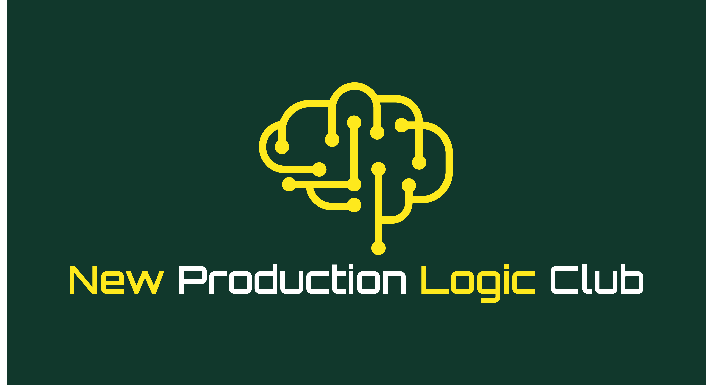

# Astuce de code Python pour la mise en production 

Pourquoi python ? 

Pck On veut discuter avec l'ordinateur .

et donc il nous faut donc un langage en l'occurence le choix se place sur Python . 

Pourquoi astuce de code Python  ? 

Parce qu'utiliser Python plus efficacement rendra votre code 

* plus lisible 
* plus maintenable 
* Plus efficace (performance).

Pourquoi pour un data scientist ? et pour la mise en production ?  

Parce que Python a une large application. 

Les outils Python utilisés dans le domaine de la datascience et du machine learning ne sont pas forcément utiles pour d’autres domaines comme :

  * le développement web.
  * Gaming 
  * Banking 

Le but de cette série est de faire connaître les moyens efficaces d'utiliser Python dans une optique de mise en production des sujets datasciences . 

Ils comprennent:

1. méthodes et bibliothèques efficaces pour travailler avec les types de données récurrents (les entiers , les floats , les booléens , les chaines de caractères , les listes ,l'itérateur, le dictionnaire , la fonction et la classe)
2. des méthodes efficaces pour travailler avec des bibliothèques de science des données populaires telles que pandas et NumPy
3. des outils efficaces à intégrer dans un projet de science des données
4. des outils efficaces à intégrer dans tout projet
5. des outils efficaces pour travailler avec Jupyter Notebook.

Bref toux ceux dont vous avez besoin en terme de code pour aller en production sereinement avec vos projets datasciences 

## Que devez-vous attendre de cette série ?

Dans cette série  comme préréquis on  attend de vous que vous ayez des connaissances de base en Python et en science des données.

Vous devez également vous attendre à des extraits de code de petite taille pour chaque section. 

Cela vous permettra d’obtenir plusieurs éléments de connaissances en moins d’une minute. 

Vous trouverez le lien vers les ressources pour chaque outil présenté au cas où vous souhaiteriez les explorer davantage .

##  À propos de cette série : 
Cette série comprendra plus de 800 conseils et outils que j'ai utilisés ,  que j'utilise et que tous ceux qui sont autonome dans la mise en production  de leurs sujets utilisent quotidiennement dans la mise en production des sujets datasciences . 

Je suis convaincu que grace à ça vous deviendrez très vite autonome pour écrire du code efficient et efficace  dans une optique de mise en production de vos sujets data et IA 

## A propos de l'auteur 

Je suis Espoir Badohoun , je suis datascientist et je partage sur ma chaine trois éléments qui je suis convaincu sont indispensables pour quiconque veut devenir autonome dans la mise en production des sujets datascience , Il s'agit essentiellement :
1. Astuce de Code Python pour la Mise en Production(Sujet du jour)
2. Mindset 
3. Stratégies datasciences 

Ma mission est de créer une communauté , un club de datascientists autonome et épanouis  dans la mise en production de sujets datasciences pour : 
1. Bénéficier des immenses opportunités qui existent sur le marché de la data et de l'Ia actuellement
2. Redorer l'image collectif des datascientists quelque peu balotés dernièrement sur les sujets de mise en production 
   

